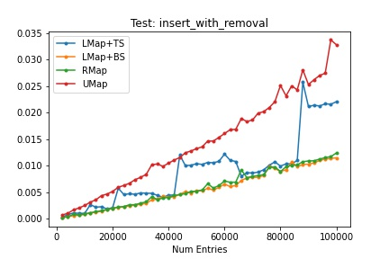
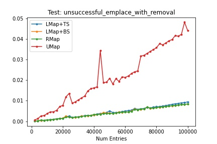

# Open Addressing HashMaps

I recently stumbled across the wild world of hashmaps when I was writing a chapter about how dictionaries are implemented in Python and fell down a pretty deep rabbit hole. Intruiged, I set out to determine whether I myself could write a hashmap faster that would rival or potentially even surpass the performance of std::unordered_map.

# Benchmarking

A more in-depth analysis of my hashmaps and descriptions of my tests can be found in the file [benchmark.ipnyb](https://github.com/andrewqho/HashMap/blob/main/bin/benchmarks.ipynb). Here are the final graphs of my performance:

