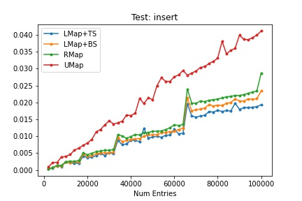
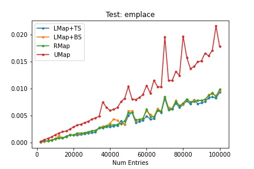
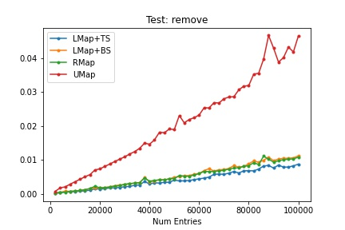
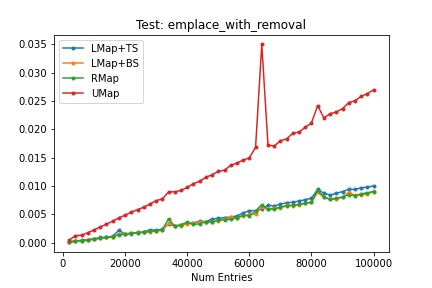

# Open Addressing HashMaps

I recently stumbled across the wild world of hashmaps when I was writing a chapter about how dictionaries are implemented in Python and fell down a pretty deep rabbit hole. Intruiged, I set out to determine whether I myself could write a hashmap faster that would rival or potentially even surpass the performance of std::unordered_map.

# How to Run the Code

The Makefile in the main directory holds all of the commands to compile, run, and clean up the code. There are three main commands:

1. **make all**: This will compile all of the correctness tests and the benchmarking script. `.o` files will be compiled to the `out/` folder and executables will be compiled to the `bin/` folder. 
2. **make test**: This will run all four test files. The last script to run will be the benchmarking code. You can also run the executables yourself, but I like running correctness code whenever I make changes so it's a handy command
3. **make clean**: This will clear out the object files, the executable files, and the `.csv` benchmarking outputs.

# The Implementations

## LinearMap with Tombstones

The first map that I made was a linear probe hashmap with tombstones for removal. This lives in [linear_map2.hpp](include/linear_map2.hpp).

## RobinhoodMap

The second map I made was a Robinhood hashmap that uses backwards shifting for removal. This lives in [robinhood_map.hpp](include/robinhood_map.hpp)

## LinearMap with Backwards Shifting

The third map I made was a modification of the tombstone LinearMap above. I modified the backwards shifting algorithm for Robinhood hashmaps to work for linear maps. The goal was to create a linearly probed hashmap with the same removal average-case time as Robinhood Hashing without the overhead of swapping for a boost in speed. This lives in [linear_map.hpp](include/linear_map.hpp).

# Benchmarking

A more in-depth analysis of my hashmaps and descriptions of my tests can be found in the file [benchmark.ipnyb](https://github.com/andrewqho/HashMap/blob/main/bin/benchmarks.ipynb). Here are the final graphs of my performance:

